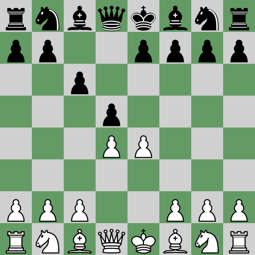

= Chess Drawer

A simple Java application to draw chess boards from a line.

== Build
Execute `mvn -p build-docker clean package` to create the docker image of the server. When the server is launched, browsing to the following URL :

`http://localhost:8080/v1/board.png?line=1.e4_c6_2.d4_d5`

will return this image :

|===
|Query Parameter | Value | Description

|lc | RRGGBB | Hexadecimal representation of the color for light squares
|dc | RRGGBB | Hexadecimal representation of the color for dark squares
|wc | true/false | if true the coordinates are drawn
|size | 1,2,3,4 | Select a size for the squares (1:16px, 2:32px, 3:64px, 4:128px)
|inv | true/false | if true, the board is inverted (black at the bottom)
|===

=== Cli command

A Cli command is also available but not packaged yet.

=== Credits

All the chess pieces, used in the software, have been made by Cburnett (Own work, CC BY-SA 3.0) :

|===
| ^| link

^a|image::https://upload.wikimedia.org/wikipedia/commons/4/42/Chess_klt45.svg[Static,32]
|https://commons.wikimedia.org/w/index.php?curid=1499806

^a|image::https://upload.wikimedia.org/wikipedia/commons/f/f0/Chess_kdt45.svg[Static,32]
|https://commons.wikimedia.org/w/index.php?curid=1499803

^a|image::https://upload.wikimedia.org/wikipedia/commons/1/15/Chess_qlt45.svg[Static,32]
|https://commons.wikimedia.org/w/index.php?curid=1499812

^a|image::https://upload.wikimedia.org/wikipedia/commons/4/47/Chess_qdt45.svg[Static,32]
|https://commons.wikimedia.org/w/index.php?curid=1499811

^a|image::https://upload.wikimedia.org/wikipedia/commons/7/72/Chess_rlt45.svg[Static,32]
|https://commons.wikimedia.org/w/index.php?curid=1499814

^a|image::https://upload.wikimedia.org/wikipedia/commons/f/ff/Chess_rdt45.svg[Static,32]
|https://commons.wikimedia.org/w/index.php?curid=1499813

^a|image::https://upload.wikimedia.org/wikipedia/commons/b/b1/Chess_blt45.svg[Static,32]
|https://commons.wikimedia.org/w/index.php?curid=1499801

^a|image::https://upload.wikimedia.org/wikipedia/commons/9/98/Chess_bdt45.svg[Static,32]
|https://commons.wikimedia.org/w/index.php?curid=1499800

^a|image::https://upload.wikimedia.org/wikipedia/commons/7/70/Chess_nlt45.svg[Static,32]
|https://commons.wikimedia.org/w/index.php?curid=1499808

^a|image::https://upload.wikimedia.org/wikipedia/commons/e/ef/Chess_ndt45.svg[Static,32]
|https://commons.wikimedia.org/w/index.php?curid=1499807

^a|image::https://upload.wikimedia.org/wikipedia/commons/4/45/Chess_plt45.svg[Static,32]
|https://commons.wikimedia.org/w/index.php?curid=1499810

^a|image::https://upload.wikimedia.org/wikipedia/commons/c/c7/Chess_pdt45.svg[Static,32]
|https://commons.wikimedia.org/w/index.php?curid=1499809

|===
